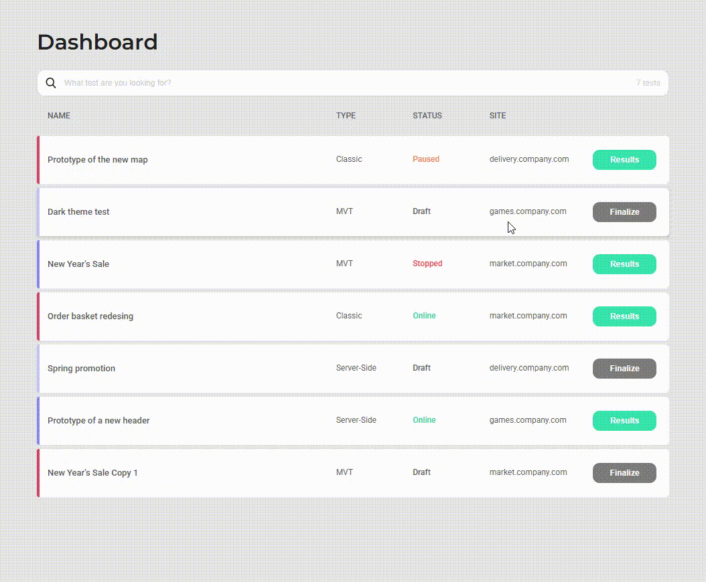

## Описание

Проект "Dashboard App" — это веб-приложение для отображения и управления A/B тестами. Пользователи могут просматривать список тестов, сортировать и фильтровать данные, а также видеть количество доступных тестов в реальном времени. Приложение построено с использованием React и TypeScript, с применением кастомных хуков для фильтрации и сортировки данных.

## Используемые технологии

- React
- TypeScript
- Axios
- SCSS
- ESLint
- Prettier

## Функционал

- **Отображение списка A/B тестов:** Данные о тестах загружаются с сервера и отображаются в виде таблицы.
- **Фильтрация данных:** Пользователь может искать тесты с использованием текстового поиска.
- **Сортировка данных:**  Возможность сортировки тестов по различным критериям (по возрастанию и убыванию).
- **Отображение количества тестов:** Отображается общее количество тестов, соответствующих текущему фильтру.
- **Спиннер загрузки:**  Показ индикатора загрузки при получении данных с сервера.

## Установка и запуск

- Клонируйте репозиторий на свой локальный компьютер.
- Создайте файл `.env` в корневой директории проекта и укажите в нем переменную окружения VITE_API_BASE_URL.
- Установите зависимости, выполнив команду npm install.
- Запустите приложение командой npm run dev.

